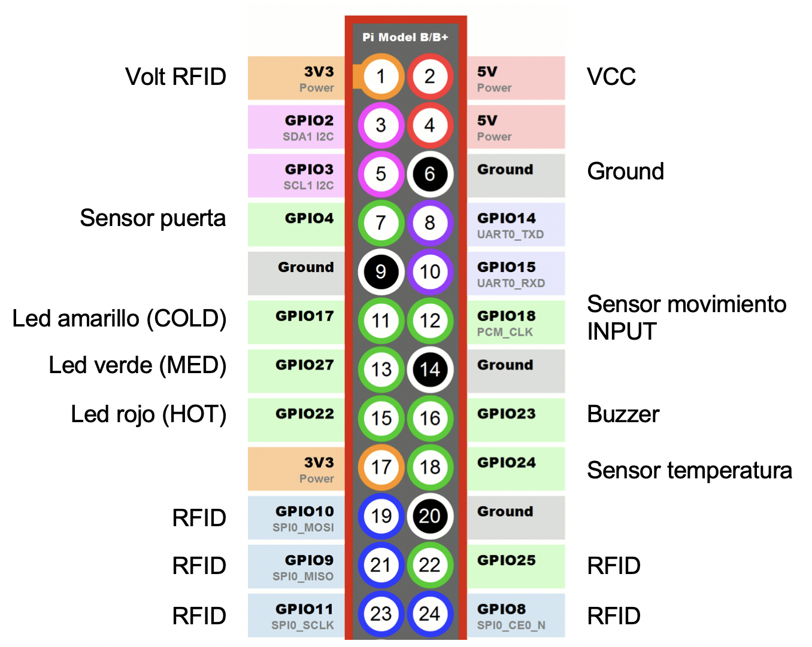
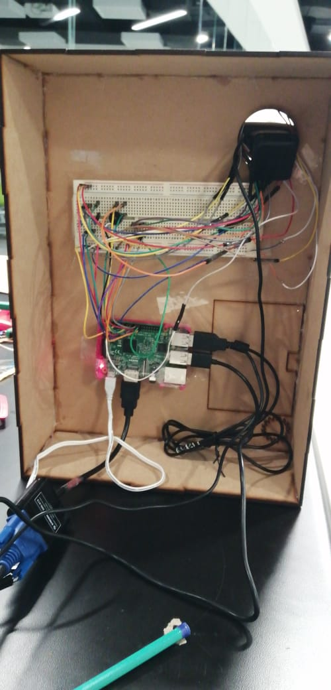

#
# IoT en el Supermercado

### Equipo Los Chocoflanes

### Integrantes:

1. Luis Daniel Roa González - A01021960 - Santa Fe
2. Juan Francisco Gortarez Ricardez - A01021926 - Santa Fe
3. Gabriel Schlam Huber - A01024122 - Santa Fe
4. Luis Armando Ortiz Revilla - A01022320 - Santa Fe
5. Simón Metta Grego - A01377925 - Santa Fe

## 1. Descripción del proyecto

Desarrollar un modelo de IoT para supermercados, específicamente para la sección de refrigeradores del mismo, que permita optimizar el manejo de los inventarios y analizar los diferentes tipos de usuarios frecuentes y sus compras, para poder tomar decisiones rápidas y adecuadas para el mercado.

Esto se realizará por medio de sensores de movimiento, apertura / cierre de puertas, temperatura, lectores de tags RFID, cámara web y leds, además del uso de Machine Learning.

## 2. Solución

A continuación aparecen descritos los diferentes elementos que forman parte de la solución del proyecto.

### 2.1 Modelos o servicios de *Machine Learning* utilizados

Nuestra solución utiliza los servicios de reconocimiento facial de Microsoft Azure para detectar la edad y el género de los compradores. Consideramos que una utilización mínima es la más adecuada para nuestras necesidades, ya que únicamente usamos estos datos para detectar tendencias de compra entre grupos de personas, e incrementar la granularidad usando elementos como raza nos pareció falta de ética.

### 2.2 Arquitectura de la solución

### 2.3 Frontend

Se utilizaron los serivicios de Google Cloud Services para poder implementar el concepto de Big Data y realizar un reporte sobre los datos de usuarios, sus compras, el inventario y las condiciones del refrigerador (temperatura y humedad).

#### 2.3.1 Lenguaje de programación

El programa realizado fue elaborado usando _Python_ versión 3.6.8.
Para más información sobre _Python_ y sus usos, a continuación se encuentra la página web: [https://docs.python.org/3/](https://docs.python.org/3/)

#### 2.3.2 Framework

Utilizamos los frameworks de MQTT con Google Cloud Services (principalmente Data Studio) para el manejo de los datos de los sensores y su presentación.

#### 2.3.3 Librerías de funciones o dependencias

* Se usaron las siguientes librerías
	* RPi.GPIO:
		* Librería que se utiliza para controlar el GPIO en una Raspberry Pi, además de asignar los pines utilizados en el circuito.
	* sys
	* json
	* time
	* subprocess
	* datetime
	* requests
	* jwt
		* Librería que permite la comunicación del Raspberry Pi con un servicio que mande/reciba información dentro de un documento de tipo _json_. jwt significa _json web token_.
	* Adafruit\_DHT
		* Librería utilizada para poder manejar la información enviada desde el sensor de temperatura y humedad con el nombre _DHT11_ y poder manipularlo a nuestro gusto.
	* paho.mqtt.client
		* Librería utilizada para poder mandar mensajes utilizando el protocolo **MQTT** , este es un protocolo utilizado especialmente para poder conectar dispositivos que pertenezcan a una red de IoT (Internet of Things)
	* pprint
		* Librería enfocada en poder imprimir de manera correcta y eficiente la información que requerimos para poder mandarla a nuestro servicio de _Google Cloud_.
	* mfrc522
		* Librería utilizada para poder manejar los datos de cualquier tag RFID, esta librería está enfocada para que el sensor _RFID-RC522_ pueda funcionar con el Raspberry Pi 3 B+.
	* requests.exceptions

### 2.4 Backend

Se utilizaron los servicios de Azure para el análisis de las imágenes de los usuarios, para poder determinar la edad y género, y poder enviarlo a la nube.

Además, se utilizó un mismo programa en Python para la compilación de todos los sensores usados como para el envío de datos a la nube, en Google Cloud Services.

Nuestro sistema manda tres tipos de tablas diferentes:

* Usuarios, enviando la fecha y hora, edad y género.
* Temperatura del refrigerador, enviando la fecha y hora, temperatura y humedad.
* Inventario y ventas, enviando el id del producto, el nombre y la cantidad.

#### 2.4.1 Lenguaje de programación

El lenguaje de programación usado fue _Python_ versión 3.6.8.
Para más información sobre _Python_ y sus usos, a continuación se encuentra la página web: [https://docs.python.org/3/](https://docs.python.org/3/)

#### 2.4.2 Framework

Utilizamos los frameworks de Azure Cognitive Services para el reconocimiento facial, y MQTT con Google Cloud Services (Cloud Functions, IoT Core, PubSub, Data Studio) para el manejo de los datos de los sensores, almacenamiento de los mismos y su presentación.

#### 2.4.3 Librerías de funciones o dependencias

* Se usaron las siguientes librerías
	* RPi.GPIO:
		* Librería que se utiliza para controlar el GPIO en una Raspberry Pi, además de asignar los pines utilizados en el circuito.
	* sys
	* json
	* time
	* subprocess
	* datetime
	* requests
	* jwt
		* Librería que permite la comunicación del Raspberry Pi con un servicio que mande/reciba información dentro de un documento de tipo _json_. jwt significa _json web token_.
	* Adafruit\_DHT
		* Librería utilizada para poder manejar la información enviada desde el sensor de temperatura y humedad con el nombre _DHT11_ y poder manipularlo a nuestro gusto.
	* paho.mqtt.client
		* Librería utilizada para poder mandar mensajes utilizando el protocolo **MQTT** , este es un protocolo utilizado especialmente para poder conectar dispositivos que pertenezcan a una red de IoT (Internet of Things)
	* pprint
		* Librería enfocada en poder imprimir de manera correcta y eficiente la información que requerimos para poder mandarla a nuestro servicio de _Google Cloud_.
	* mfrc522
		* Librería utilizada para poder manejar los datos de cualquier tag RFID, esta librería está enfocada para que el sensor _RFID-RC522_ pueda funcionar con el Raspberry Pi 3 B+.
	* requests.exceptions

Nosotros tenemos cuatro endpoints que se conectan con la nube:

* **Azure Cognitive Services (Reconocimiento Facial):**
	* **Descripción**:
		* Se envía una solicitud con una imagen para recibir los datos característicos de la misma, como edad, tamaño de la cara, género y el formato.
	* **Headers**:
		* {"Content-Type": "application/octet-stream", 'Ocp-Apim-Subscription-Key': '7e9cfbb244204fb994babd6111235269'}
	* **Formato JSON del cuerpo de la solicitud**:
		* face\_uri, headers, data
		* Donde:
			* face\_uri = &quot;https://raspberrycp.cognitiveservices.azure.com/vision/v1.0/analyze?visualFeatures=Faces&amp;language=en&quot;
			* data = imagen tomada
	* **Formato JSON de la respuesta**:
		*	{'faces': [{'age': *age*,
									'faceRectangle': {'height': *height*,
																		'left': *left*,
																		'top': *top*,
																		'width': *width*},
									'gender': *'gender'*}],
			 'metadata': {'format': *'format'*, 'height': *'height'*, 'width': *'width'*},
			 'requestId': *'requestId'*}

* **Google Cloud Services #1 (Usuarios):**
	* **Descripción**:
		* Se toman los datos importantes regresados por Azure para nuestro registro y se envían a Google Cloud, junto con la fecha y hora. Además del id del producto que está comprando.
	* **Formato JSON del cuerpo de la solicitud**:
		* '{{ "ts": {}, "age": {}, "gender": "{}", "id": {} }}';.format(int(time.time()), faces\_list[0],faces\_list[1], faces\_list[2])
	* **Formato JSON de la respuesta**:
		* Como tal no hay un formato JSON de respuesta, sino hay un mensaje de "no error".

* **Google Cloud Services #2 (Estatus Refrigerador):**
	* **Descripción**:
		* Se envían a Google Cloud los datos recibidos del sensor de temperatura, siendo la temperatura y la humedad, junto con la fecha y hora.
	* **Formato JSON del cuerpo de la solicitud**:
		* '{{ "ts": {}, "temperature": {}, "humidity": "{}" }}';.format(int(time.time()), temper\_list[0],temper\_list[1])
	* **Formato JSON de la respuesta**:
		* Como tal no hay un formato JSON de respuesta, sino hay un mensaje de "no error".

* **Google Cloud Services #3 (Estatus Almacén):**
	* **Descripción**:
		* Se envían a Google Cloud los datos del inventario en ese momento, siendo el ID de producto, el nombre del producto y la cantidad en existencia.
	* **Formato JSON del cuerpo de la solicitud**:
		* '{{ "updated": {},"id": {}, "producto": "{}", "cantidad": {} }}'.format(int(time.time()), product_list[0],product_list[1],product_list[2].strip("\n"))
	* **Formato JSON de la respuesta**:
		* Como tal no hay un formato JSON de respuesta, sino hay un mensaje de "no error".

### 2.5 Sensores

Todos los sensores menos uno fueron consolidados en un solo programa de Python, e implementados de una manera selectivamente asíncrona. Lo que esto significa es que, en un caso de uso normal, al inicio solamente se tienen dos sensores funcionando: el detector magnético de apertura y el de temperatura. Esto prosigue hasta que se detecte una apertura de puerta: a partir de este momento, se toma una foto usando la webcam, y se empieza a detectar (asíncronamente) si la persona que abrió la puerta dejó o ingresó un producto, y también si la puerta se ha dejado abierta después que el usuario se ha ido.

Los sensores utilizados ( y la liga de donde obtuvimos su información) fueron los siguientes:
* **Temperatura/Humedad:** [https://github.com/adafruit/Adafruit\_Python\_DHT](https://github.com/adafruit/Adafruit_Python_DHT)
* **Movimiento:** [https://www.internetdelascosas.cl/2013/05/13/sensor-de-presencia-en-raspberry-pi/](https://www.internetdelascosas.cl/2013/05/13/sensor-de-presencia-en-raspberry-pi/)
* **Apertura Magnética:** [https://www.alexisabarca.com/2016/01/usar-un-sensor-de-puerta-magnetico-en-un-raspberry-pi/](https://www.alexisabarca.com/2016/01/usar-un-sensor-de-puerta-magnetico-en-un-raspberry-pi/)
* **Webcam:** [https://github.com/vcubells/iot\_supermercado/blob/master/demo\_02/01\_Sensors.py](https://github.com/vcubells/iot_supermercado/blob/master/demo_02/01_Sensors.py)
* **Lectoescritor de RFID:** [https://medium.com/coinmonks/for-beginners-how-to-set-up-a-raspberry-pi-rfid-rc522-reader-and-record-data-on-iota-865f67843a2d](https://medium.com/coinmonks/for-beginners-how-to-set-up-a-raspberry-pi-rfid-rc522-reader-and-record-data-on-iota-865f67843a2d)

#### 2.5.1 Lenguaje de programación**

El lenguaje de programación usado fue _Python_ versión 3.6.8.
Para más información sobre _Python_ y sus usos, a continuación se encuentra la página web: [https://docs.python.org/3/](https://docs.python.org/3/)

#### 2.5.2 Framework

Para los sensores no utilizamos ningún framework para su funcionamiento óptimo.

#### 2.5.3 Librerías de funciones o dependencias

Para el funcionamiento de los sensores se usaron tres librerías importantes:
* RPi.GPIO, la cual es la librería para la utilización de los pines en la Rpi
* mfrc522, la cual es la librería/API para la escritura y lectura de chips RFID a partir de un sensor conectado por pines
* Adafruit, la cual es una librería general de I/O, que en este proyecto fue utilizada para el input del sensor de temperatura y humedad

### 2.6 Pasos a seguir para utilizar el proyecto

Para poder utilizar este proyecto, se debe clonar este repositorio y seguir los pasos mencionados en el documento contenido en la carpeta "docs"

## 3. Referencias
* Librería de Python
	* [https://docs.python.org/3/](https://docs.python.org/3/)
* Librería de RPi.GPIO
	* [https://pypi.org/project/RPi.GPIO/](https://pypi.org/project/RPi.GPIO/)
* Librería de jwt (_Jason Web Token_)
	* [https://pypi.org/project/jwt/](https://pypi.org/project/jwt/)
* Librería de Adafruit\_DHT
	* [https://circuitpython.readthedocs.io/projects/dht/en/latest/](https://circuitpython.readthedocs.io/projects/dht/en/latest/)
* Librería de _paho.mqtt.client_
	* [https://pypi.org/project/paho-mqtt/](https://pypi.org/project/paho-mqtt/)
* Librería de _pprint_ (_pretty print_)
	* [https://docs.python.org/3/library/pprint.html](https://docs.python.org/3/library/pprint.html)
* Librería de MFRC522
	* [https://www.nxp.com/docs/en/data-sheet/MFRC522.pdf](https://www.nxp.com/docs/en/data-sheet/MFRC522.pdf)
* Documentación de _Microsoft Azure Cognitive Services_
	* [https://docs.microsoft.com/en-us/azure/cognitive-services/](https://docs.microsoft.com/en-us/azure/cognitive-services/)